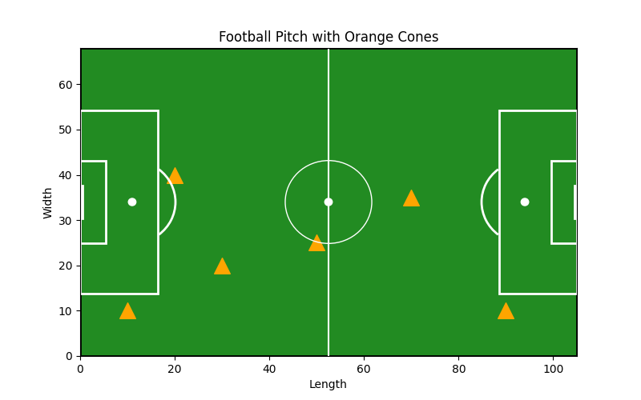

# ⚽ AR Soccer Drill Setup 📱

Revolutionize Your Training with Augmented Reality

Welcome to AR Soccer Drill Setup, the ultimate tool for soccer players and coaches! Using augmented reality (AR), this app helps you precisely position training cones and markers on the field, directly through your iPhone. Say goodbye to guesswork and hello to accuracy and efficiency in setting up your drills!

## 🎯 Features

- 🟠 AR Cone Placement: Use your iPhone to visualize and position cones in real-time.
- 📐 Precision Layouts: Customize drill patterns with exact distances and angles.
- 📋 Pre-Set Templates: Choose from pre-designed setups for passing drills, dribbling courses, and more.
- 📱 Save and Share: Save your layouts and share them with teammates or other coaches.

## 🚀 Getting Started

Follow these steps to set up the app and start creating AR-enhanced soccer drills.

## 🔧 Prerequisites

- iPhone with ARKit support (iOS 13 or later recommended).
- Sufficient field space for running drills.

## 📥 Installation

1. Download from the App Store:
Search for “AR Soccer Drill Setup” and install the app.
2. Grant Permissions:
Upon first launch, allow access to your camera and motion sensors for AR functionality.

## 🏃‍♂️ How to Use

1. Launch the App:
Open the app and select “Start New Drill.”
2. Choose Your Layout:
Pick a pre-set drill or create a custom layout by specifying cone positions.
3. Position Your Cones:
Use your iPhone camera to visualize AR cones on the field. Move and adjust their placement until perfect.
4. Save Your Layout:
Save your setup to reuse for future training sessions or share with others.

## 🔍 Tips for Best Results

- Use the app in well-lit environments for optimal AR tracking.
- Keep your phone steady while placing cones for better accuracy.
- Measure your physical cone placement against the AR overlay for precise alignment.

## 🛠 Development Notes

This project is built with:

- 🛠 ARKit: Leveraging Apple’s ARKit for accurate AR visualization.
- 📱 SwiftUI: A modern and intuitive UI for iPhone users.
- 📊 Core Motion: Ensuring smooth tracking and placement on the field.

## 📢 Contributors

This app was brought to life by a team of soccer enthusiasts and AR developers. See the contributors list for more details.

## 📜 License

This project is licensed under the MIT License. See the LICENSE.md file for more details.

⚽ “Train smarter, not harder. With AR Soccer Drill Setup, precision meets simplicity on the field.”

Download the app and transform your training sessions today! 🟠📱
